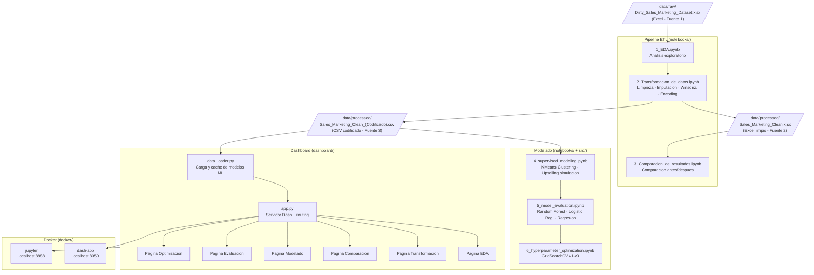

# Sales Marketing Dataset

Proyecto de analisis, transformacion y comparacion de resultados para un dataset de ventas y marketing.

## Objetivo

Estandarizar un dataset con problemas de calidad (nulos, formatos inconsistentes y valores extremos), generar versiones limpias para analisis/modelado y comparar resultados antes vs despues de la transformacion.

## Arquitectura del sistema

El proyecto implementa un pipeline ETL completo desde los datos crudos hasta la visualizacion interactiva en un dashboard desplegable con Docker.



### Flujo de datos

| Etapa | Entrada | Proceso | Salida |
|---|---|---|---|
| Extraccion | Excel sucio (5.000 filas) | Carga con pandas | DataFrame crudo |
| Transformacion | DataFrame crudo | Imputacion, winsoriz., encoding | Excel limpio + CSV codificado |
| Analisis | CSV codificado | EDA, comparacion | Figuras en `outputs/figures/` |
| Modelado | CSV codificado | KMeans, RF, LR, GridSearchCV | Modelos en cache de sesion |
| Visualizacion | Todos los artefactos | Plotly Dash | Dashboard interactivo |
| Despliegue | Proyecto completo | Docker Compose | Servicios en contenedores |

## Preparacion del entorno

1. Crear entorno virtual:

```bash
python -m venv venv
```

2. Activar entorno virtual:

Windows (PowerShell):

```powershell
.\venv\Scripts\Activate.ps1
```

Linux/macOS:

```bash
source venv/bin/activate
```

3. Instalar dependencias:

```bash
pip install -r requirements.txt
```

## Estructura de trabajo

- notebooks/1_EDA.ipynb: analisis exploratorio inicial.
- notebooks/2_Transformacion_de_datos.ipynb: limpieza, imputacion, winsorizacion, codificacion y exportaciones.
- notebooks/3_Comparacion_de_resultados.ipynb: comparacion entre dataset sucio y limpio + generacion de figuras.
- notebooks/4_supervised_modeling.ipynb: segmentacion (clustering) + simulacion inicial de campana de upselling.
- notebooks/5_model_evaluation.ipynb: evaluacion comparativa de modelos de clasificacion y regresion con narrativa de conclusiones.
- notebooks/6_hyperparameter_optimization.ipynb: optimizacion de hiperparametros (v1-v4), analisis de matrices y ajuste de umbral operativo.
- src/Routes.py: rutas centralizadas del proyecto (raw, processed, notebooks, figures).

## Orden recomendado de ejecucion

0. **[NUEVO]** Ejecutar notebooks/0_ETL_Validation.ipynb para validar esquemas y calidad de datos (genera `etl_pipeline.log`).
1. Ejecutar notebooks/1_EDA.ipynb.
2. Ejecutar notebooks/2_Transformacion_de_datos.ipynb para generar datasets de salida en data/processed/.
3. Ejecutar notebooks/3_Comparacion_de_resultados.ipynb para generar comparativas y figuras en outputs/figures/.
4. Ejecutar notebooks/4_supervised_modeling.ipynb para validar segmentacion de clientes y simulacion inicial de upselling.
5. Ejecutar notebooks/5_model_evaluation.ipynb para comparar desempeno de Random Forest vs Regresion Logistica y evaluar regresion de total_spent.
6. Ejecutar notebooks/6_hyperparameter_optimization.ipynb para optimizar versiones v1-v4, justificar decisiones de modelo y calibrar umbral de campana.

## Parte 4 - Modelado y simulacion inicial (notebook 4)

En esta parte se combinan dos bloques:

1. No supervisado (clustering):
	 - Variables de comportamiento seleccionadas para segmentacion operativa.
	 - Escalado con StandardScaler para evitar sesgo por magnitud.
	 - Validacion con Elbow + Silhouette y eleccion de K=3 por accionabilidad de negocio.
2. Supervisado (simulacion de upselling):
	 - Entrenamiento base de Random Forest y Regresion Logistica.
	 - Simulacion con umbral alto (0.75) sobre clientes basicos.
	 - Resultado observado: Random Forest identifica 1 cliente potencial; Regresion Logistica identifica 0.

Decision metodologica:

- Se prioriza Random Forest para la siguiente fase porque muestra mayor capacidad para capturar patrones no lineales del problema de conversion.

## Parte 5 - Evaluacion de modelos (notebook 5)

Esta parte consolida la evaluacion tecnica y narrativa:

- Clasificacion:
	- Comparacion de Random Forest vs Regresion Logistica con reportes y matrices.
	- Conclusiones estandarizadas en formato informe: diagnostico, interpretacion, cierre y siguiente accion.
- Regresion (target: total_spent):
	- Comparacion de LinearRegression vs RandomForestRegressor.
	- Metricas usadas: RMSE y R2.
	- Resultado observado en la corrida actual: RandomForestRegressor supera a LinearRegression (menor RMSE y mayor R2).

Decision metodologica:

- Se mantiene Random Forest como baseline principal para clasificacion y regresion en este dataset, usando modelos lineales como benchmark de control.

## Parte 6 - Optimizacion de hiperparametros (notebook 6)

Esta parte implementa una ruta iterativa de mejora v1-v4 enfocada en upselling:

- v1: baseline con grilla amplia.
- v2: mismas tecnicas con solo columnas de comportamiento.
- v3: objetivo orientado a negocio (clase positiva = upgrade).
- v4: RandomizedSearchCV optimizado por Average Precision.

Metricas destacadas de la ultima corrida:

- v1 ROC-AUC test: 0.6094
- v2 ROC-AUC test: 0.6059
- v3 ROC-AUC test: 0.6146
- v4 ROC-AUC test: 0.6322
- v4 Average Precision test: 0.6594

Calibracion de decision:

- Se calcula umbral operativo por maximo F1.
- Umbral recomendado observado: 0.3378
- Precision/Recall en ese punto: 0.5507 / 0.9838
- Interpretacion: alta captura de oportunidades (recall alto) con costo de mas falsos positivos; el umbral debe ajustarse segun presupuesto y capacidad comercial.

## Transformaciones aplicadas

### Imputacion de datos

Reglas implementadas en notebooks/2_Transformacion_de_datos.ipynb:

- age:
	- Limpieza previa de strings (espacios y variantes de nan como texto).
	- Imputacion por mediana global.
	- Conversion final a entero.
- total_spent:
	- Imputacion por mediana dentro de cada subscription_type.
	- Fallback a mediana global si algun grupo queda sin valor imputable.
- satisfaction_score:
	- Imputacion por mediana global.
- gender:
	- Estandarizacion de formato y reemplazo de nulos por Unknown.
- country:
	- Imputacion por moda global.

### Tratamiento de outliers

Se aplica winsorizacion basada en IQR (sin eliminar filas):

- Regla: limites en Q1 - 1.5 * IQR y Q3 + 1.5 * IQR.
- Accion: clip de valores fuera de limites.
- Variables tratadas:
	- age, total_spent, avg_order_value, lifetime_value, total_visits,
		avg_session_time, pages_per_session, support_tickets y delivery_delay_days.
- Post-proceso:
	- Restauracion de tipo entero en age, total_visits, support_tickets y delivery_delay_days.

### Codificacion con LabelEncoder

Despues de construir df_limpio, se crea un segundo dataset (df_codificado) usando LabelEncoder de scikit-learn.

Columnas codificadas:

- gender
- country
- acquisition_channel
- subscription_type
- payment_method

Nota importante:

- La codificacion se ajusta en el mismo notebook por columna y transforma solo el dataset final codificado.
- El dataset limpio original (sin codificar) se conserva por separado para analisis interpretables.

## Guardado diferenciado de archivos resultantes

El pipeline genera salidas separadas segun objetivo de uso:

1. Dataset limpio para analisis (formato tabular original):
	 - data/processed/Sales_Marketing_Clean.xlsx
2. Dataset codificado para modelado:
	 - data/processed/Sales_Marketing_Clean_(Codificado).csv
3. Figuras de comparacion (notebook 3):
	 - outputs/figures/conteo_nulos_bar.png
	 - outputs/figures/heatmap_nulos.png
	 - outputs/figures/conteo_generos_sucios_bar.png
	 - outputs/figures/conteo_generos_limpios_bar.png

## Validación de esquemas y manejo de errores

El pipeline implementa validación robusta de esquemas y manejo profesional de errores mediante el módulo `src/etl_validation.py`.

### Características

**1. Validación de esquemas**
- Define esquemas esperados (SCHEMA_RAW, SCHEMA_CLEAN) con tipos, rangos y valores válidos
- Detecta columnas faltantes, valores fuera de rango y datos inválidos
- Registra advertencias y errores en logs profesionales

**2. Evaluación de calidad de datos**
- Calcula métricas: filas, columnas, ratio de nulls, duplicados, uso de memoria
- Compara calidad antes y después de transformaciones
- Detecta problemas de integridad

**3. Logging profesional**
- Archivo `etl_pipeline.log` con timestamps, niveles (DEBUG, INFO, WARNING, ERROR)
- Salida a consola (INFO+) y archivo (DEBUG+)
- Trazabilidad completa del pipeline

**4. Manejo de errores**
- Try/except bloques con mensajes descriptivos
- Decorador `@handle_etl_errors` para capturar excepciones
- Recuperación elegante ante fallos de I/O y parsing

### Uso en notebooks

```python
from src.etl_validation import (
    setup_etl_logger,
    validate_schema,
    validate_data_quality,
    SCHEMA_RAW,
    SCHEMA_CLEAN
)

# Configurar logger
logger = setup_etl_logger(log_file='etl_pipeline.log')

# Validar esquema
is_valid, errors = validate_schema(df, SCHEMA_RAW, stage_name="CARGA", logger=logger)

# Evaluar calidad
metrics = validate_data_quality(df, stage_name="CARGA", logger=logger)
```

### Notebook de validación

Ejecuta **notebooks/0_ETL_Validation.ipynb** para ver un ejemplo completo que:
- Carga el dataset crudo
- Valida esquemas
- Evalúa calidad
- Registra logs detallados

## Testing automatizado del ETL

Se incluye una suite de tests para validar la integridad del pipeline ETL.

### Ejecutar tests

```bash
# Desde la raiz del proyecto
python tests/test_etl.py
```

O con pytest:
```bash
pip install pytest
pytest tests/test_etl.py -v
```

### Tests incluidos

| # | Test | Descripción |
|---|---|---|
| 1 | `test_raw_data_exists` | Verifica que el dataset crudo existe |
| 2 | `test_raw_data_shape` | Valida dimensiones del dataset crudo (≥ 4000 filas) |
| 3 | `test_clean_data_exists` | Verifica que el dataset limpio existe |
| 4 | `test_schema_raw` | Valida esquema del dataset crudo |
| 5 | `test_schema_clean` | Valida esquema del dataset limpio (debe pasar) |
| 6 | `test_data_quality_raw` | Evalúa métrica de calidad del dataset crudo |
| 7 | `test_data_quality_clean` | Evalúa calidad del dataset limpio (nulls < 1%) |
| 8 | `test_files_consistency` | Verifica consistencia entre archivos |

### Ejemplo de output

```
======================================================================
INICIANDO SUITE DE TESTS DEL PIPELINE ETL
======================================================================

[TEST 1] Verificando existencia del dataset crudo...
  ✅ Dataset crudo encontrado: .../data/raw/Dirty_Sales_Marketing_Dataset.xlsx

[TEST 2] Verificando shape del dataset crudo...
  ✅ Shape válido: 5000 filas × 15 columnas

...

======================================================================
RESULTADOS: 8 passed, 0 failed
======================================================================
```


## Validaciones tecnicas implementadas

- Optimizacion de memoria con downcasting y medicion cuantitativa del impacto en bytes y porcentaje.
- Agrupacion multivariable por country y subscription_type.
- Tabla dinamica con pivot_table para acquisition_channel vs country.

## Dashboard Interactivo (Plotly Dash)

El proyecto incluye un dashboard interactivo con menu lateral izquierdo y 6 paginas, una por cada notebook.

### Ejecucion

```bash
# Desde la raiz del proyecto (con el venv activo)
python main.py
# Abre http://127.0.0.1:8050 en el navegador
```

### Paginas disponibles

| Pagina | Contenido |
|--------|-----------|
| EDA | Histogramas, boxplots, heatmap de correlacion, categoricas, outliers IQR |
| Transformacion | Pipeline paso a paso, tipos de datos, estadisticas, muestra del dataset |
| Comparacion | Nulos y distribuciones antes/después, normalizacion categorica |
| Modelado | Codo + Silhouette, PCA 2D, centroides, radar de perfiles, distribucion por cluster |
| Evaluacion | Matrices de confusion, curvas ROC, metricas por clase, regresion, simulacion upselling |
| Optimizacion | Evolucion AUC por version, mejores hiperparametros (GridSearchCV), resumen ejecutivo |

### Estructura del dashboard

```
dashboard/
├── app.py                    <- Aplicacion Dash (importada por main.py)
├── data_loader.py            <- Carga de datos y modelos con cache
├── pages/                    <- Una pagina por notebook
│   ├── page_eda.py
│   ├── page_transformacion.py
│   ├── page_comparacion.py
│   ├── page_modelado.py
│   ├── page_evaluacion.py
│   └── page_optimizacion.py
└── assets/
    └── custom.css            <- Estilos del sidebar y tarjetas
```

> Nota: la pagina de Optimizacion ejecuta GridSearchCV (cv=3) la primera vez que se visita, lo que puede tardar 1-2 minutos. Los resultados quedan en cache durante la sesion.

## Manual de usuario del dashboard

El dashboard esta diseñado para dos audiencias: **analistas de negocio** (paginas 1-3) y **cientificos de datos** (paginas 4-6). Se navega mediante el menu lateral izquierdo.

### Pagina 1 – Analisis Exploratorio (EDA)
**Audiencia:** Analistas, equipo de negocio

| Control | Descripcion |
|---|---|
| Dropdown variable numerica | Selecciona la variable a visualizar en el histograma |
| Slider bins | Ajusta la granularidad del histograma (10-80 bins) |
| Multi-select boxplot | Selecciona multiples variables para comparar distribuciones |

- El histograma incluye lineas verticales de media y mediana para identificar asimetria.
- El heatmap de correlacion usa Spearman (robusto ante outliers).
- La tabla de outliers muestra la cantidad de valores extremos por variable segun regla IQR.

### Pagina 2 – Transformacion de Datos
**Audiencia:** Ingenieros de datos, analistas

- Visualiza el pipeline ETL como un diagrama de 6 pasos en secuencia.
- Permite inspeccionar la composicion de tipos de datos antes y despues de la limpieza.
- El dropdown de variable muestra estadisticas descriptivas (media, std, min, max, cuartiles).
- La tabla de muestra presenta las primeras 10 filas del dataset procesado.

### Pagina 3 – Comparacion de Resultados
**Audiencia:** Analistas, stakeholders

| Control | Descripcion |
|---|---|
| Dropdown variable | Selecciona que variable comparar entre dataset sucio y limpio |

- El grafico de nulos compara la cantidad de valores faltantes antes y despues del ETL.
- La distribucion superpuesta muestra el impacto de la imputacion y winsoriz. en cada variable.
- La tabla de metricas muestra min, max, media y mediana para ambas versiones en paralelo.

### Pagina 4 – Modelado (Clustering)
**Audiencia:** Cientificos de datos, equipos de ML

| Control | Descripcion |
|---|---|
| Multi-select variables centroides | Selecciona que variables comparar entre los 3 clusters |

- El metodo del codo y la curva Silhouette justifican la eleccion de K=3.
- El scatter PCA 2D muestra la separacion geometrica de los clusters en espacio reducido.
- El radar normalizado compara los 3 perfiles: **Activos**, **Regulares** y **Esporadicos**.

### Pagina 5 – Evaluacion de Modelos
**Audiencia:** Cientificos de datos

| Control | Descripcion |
|---|---|
| Radio button modelo | Alterna entre Random Forest y Regresion Logistica |
| Slider umbral | Ajusta el umbral de decision para la simulacion de upselling (0.1 – 0.95) |

- Las curvas ROC incluyen el valor AUC en la leyenda.
- El histograma de probabilidades muestra la separabilidad del modelo.
- La simulacion de upselling filtra clientes basicos y cuenta cuantos superan el umbral elegido.

### Pagina 6 – Optimizacion de Hiperparametros
**Audiencia:** Cientificos de datos, MLOps

| Control | Descripcion |
|---|---|
| Dropdown version | Muestra la matriz de confusion de la version seleccionada (v1, v2, v3) |

- **Primera visita:** ejecuta GridSearchCV con cv=3. Puede tardar 1-2 minutos.
- Compara tres hipotesis: v1 (todas las features), v2 (solo comportamiento), v3 (target invertido).
- Los KPIs resaltan automaticamente la version con mayor ROC-AUC.
- La tabla de hiperparametros muestra los mejores parametros encontrados por GridSearchCV.

## Guia de despliegue con Docker

### Requisitos previos
- [Docker Desktop](https://www.docker.com/products/docker-desktop/) instalado y corriendo
- Git (para clonar el repositorio)

### Instrucciones paso a paso

**1. Clonar el repositorio**
```bash
git clone <URL_del_repositorio>
cd Sales_Marketing_Dataset
```

**2. Construir y levantar los servicios**
```bash
cd docker
docker-compose up --build
```

La primera vez descarga la imagen base Python 3.13 e instala todas las dependencias (~3-5 min). Las siguientes ejecuciones usan cache y son casi instantaneas.

**3. Acceder a los servicios**

| Servicio | URL | Descripcion |
|---|---|---|
| Dashboard interactivo | http://localhost:8050 | Plotly Dash con 6 paginas |
| JupyterLab | http://localhost:8888 | Notebooks del pipeline ETL y modelado |

**4. Detener los servicios**
```bash
docker-compose down
```

### Variables de entorno

| Variable | Valor por defecto | Descripcion |
|---|---|---|
| `PORT` | `8050` | Puerto del servidor Dash |

Para cambiar el puerto del dashboard:
```yaml
# En docker/docker-compose.yml
environment:
  - PORT=9090
ports:
  - "9090:9090"
```

### Estructura Docker

```
docker/
├── Dockerfile          <- Imagen Python 3.13-slim con dependencias del proyecto
└── docker-compose.yml  <- Orquestacion de servicios (dashboard + jupyter)
```

> **Nota de seguridad:** JupyterLab se expone sin password (`token=''`). Usar unicamente en redes locales o de confianza. Para produccion, configurar autenticacion en docker-compose.yml.


## Notas operativas

- Las rutas se gestionan desde src/Routes.py mediante el diccionario RUTAS.
- data/processed/ y outputs/figures/ contienen artefactos generados por notebooks.
- El proyecto ignora archivos de documentacion (docs/) y comprimidos (*.zip) mediante .gitignore para evitar versionar adjuntos pesados o de apoyo.
