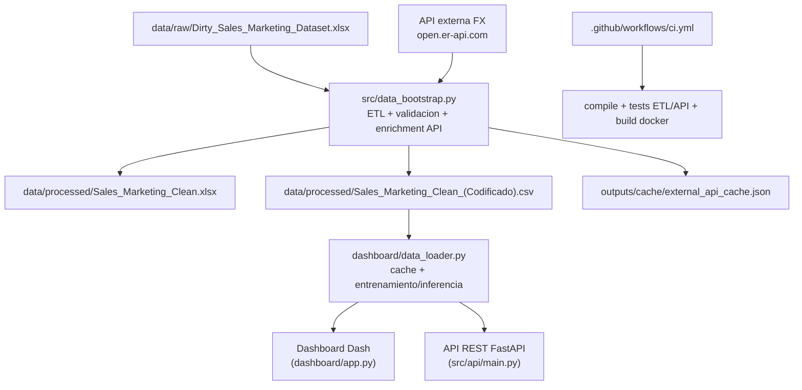

# Sales Marketing Dataset

Version definitiva del proyecto de transformacion de datos, modelado ML, API REST y visualizacion interactiva para campañas de conversion.

## Estado del proyecto

Proyecto operativo end-to-end:

- ETL reproducible con validacion de esquema y calidad.
- Modelos ML supervisados y no supervisados con tuning.
- API REST de negocio documentada (OpenAPI/Swagger).
- Dashboard interactivo orientado a usuario final por audiencias.
- Containerizacion con Docker Compose.
- Integracion continua con GitHub Actions.

## Objetivo

Estandarizar un dataset con problemas de calidad, construir analitica y modelos accionables, y exponer resultados mediante dashboard y API para toma de decisiones comerciales.

## Arquitectura (actual)



## Estructura principal

```text
.
├── main.py
├── dashboard/
│   ├── app.py
│   ├── data_loader.py
│   ├── i18n.py
│   └── pages/
├── src/
│   ├── data_bootstrap.py
│   ├── etl_validation.py
│   ├── external_api_enrichment.py
│   └── api/main.py
├── tests/
│   ├── test_etl.py
│   └── test_api.py
├── docker/
│   ├── Dockerfile
│   └── docker-compose.yml
├── scripts/
│   └── run_quality_checks.py
├── .github/workflows/
│   └── ci.yml
└── docs/
    ├── API_REST.md
    └── Checklist_Cumplimiento_Tecnico.md
```

## Componentes funcionales

### 1) ETL y calidad de datos

- Limpieza, imputacion, winsorizacion y codificacion.
- Validacion de esquemas con `SCHEMA_RAW` y `SCHEMA_CLEAN`.
- Logging ETL en `etl_pipeline.log`.
- Enriquecimiento REST externo (USD->CLP) con cache, TTL, retry y fallback.

Columnas derivadas de enriquecimiento:

- `fx_usd_to_clp`
- `total_spent_usd`
- `avg_order_value_usd`

### 2) Modelado ML

- No supervisado: KMeans (segmentacion de clientes).
- Supervisado:
  - Clasificacion: Random Forest / Regresion Logistica.
  - Regresion: Linear Regression / Random Forest Regressor.
- Optimizacion: RandomizedSearchCV (versiones comparativas).
- Metricas: AUC, matriz de confusion, precision/recall/F1, RMSE, R2.

### 3) Dashboard interactivo

Acceso principal por audiencias:

- Vista Ejecutiva
- Vista Operativa
- Vista Tecnica (hub de modulos)

Capacidades destacadas:

- Segmentacion y scoring por cliente.
- Umbral dinamico de campaña.
- KPIs y graficos interactivos.
- Selector ES/EN con cache y persistencia de idioma.

### 4) API REST de negocio

Servicio FastAPI con OpenAPI:

- Swagger: `http://localhost:8000/docs`
- ReDoc: `http://localhost:8000/redoc`

Endpoints:

- `GET /health`
- `POST /predict/conversion`
- `GET /campaign/targets`

Documentacion detallada:

- `docs/API_REST.md`

## Ejecucion rapida (Docker)

```bash
cd docker
docker-compose up --build
```

Servicios:

- Dashboard: `http://localhost:8050`
- API REST (Swagger): `http://localhost:8000/docs`
- JupyterLab: `http://localhost:8888`

Detener:

```bash
docker-compose down
```

## Ejecucion local (sin Docker)

1. Crear y activar entorno virtual.
2. Instalar dependencias:

```bash
pip install -r requirements.txt
```

3. Ejecutar dashboard:

```bash
python main.py
```

4. Ejecutar API REST:

```bash
uvicorn src.api.main:app --host 0.0.0.0 --port 8000
```

## Calidad, pruebas y CI

Checks locales:

```bash
python scripts/run_quality_checks.py
```

Incluye:

- Compilacion de modulos principales.
- Tests ETL (`tests/test_etl.py`).
- Tests API (`tests/test_api.py`).

CI en GitHub Actions:

- Workflow: `.github/workflows/ci.yml`
- Pasos: install -> compile -> tests -> docker build.

## Notas operativas

- Si faltan artefactos de `data/processed`, se regeneran automaticamente al iniciar (`main.py`).
- Si falta la fuente cruda en `data/raw`, no es posible reconstruir processed.
- JupyterLab en docker-compose se expone sin autenticacion (uso local/red confiable).

## Evidencia de cumplimiento

Checklist actualizado de cumplimiento tecnico:

- `docs/Checklist_Cumplimiento_Tecnico.md`
